# AqMood - a slightly emotional Air Quality Monitor

Measures PM2.5, VOC, CO2, NOX, Temp and Humidity, Shows emojis or details on LCD and uses aRGB Leds to show air quality

## Description

This is my last iteration of a DIY Air Quality Monitor.

## Features

Emoji and LED-Based AirQuality Display

1.8" Color LCD with 6 Display Modes

13 x aRGB Leds to show AQI for PM, VOC and CO2

Touch Button - Short press cycles through display modes, long press toggles Leds

Measures
* PM(1.0, 2.5, 4.0, 10)
* VOC
* CO2
* NOX
* Temperature
* Humidity
* Touch button - cycles display modes, long press controls LEDs
* HomeAssistant integration (optional)
* Quite easy to build with custom PCB

Home Assistant integration 

### Display modes

aqMood offers 6 different display modes. The LEDs can be turned on and off.

#### aRGB LEDs used to indicate AQI for PM2.5, VOC, CO2
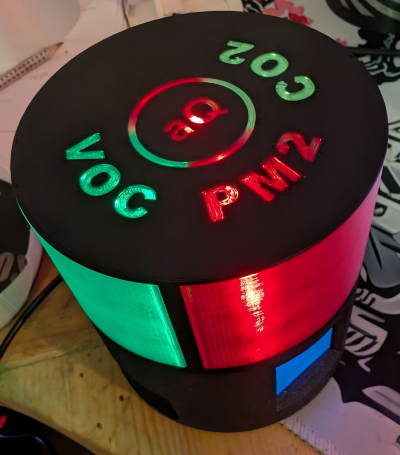

#### Big Emoji - Summarize alle 3 AQI (PM2.5,VOC,CO2)
")
 
#### Emoji AQI overview
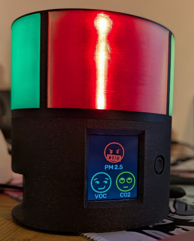

#### AQI Details
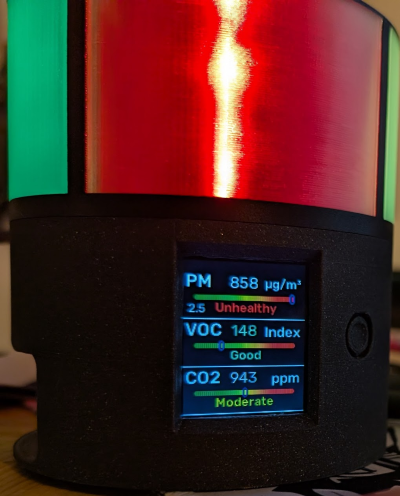

#### Temperature, Humidity and NOX
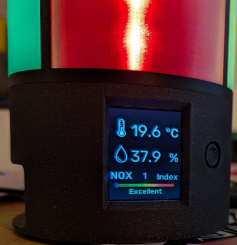

#### Particles details
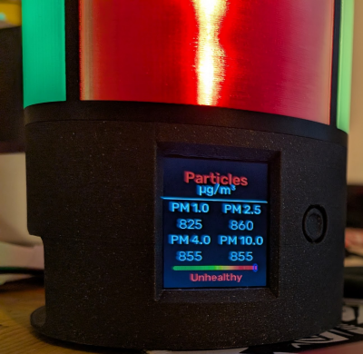

#### Off ;)
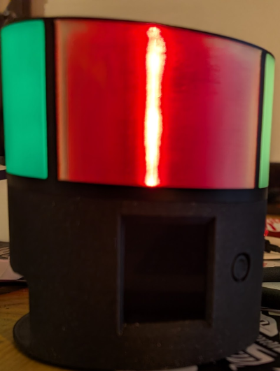

## How is it built?

Esphome based

### Bill of Material
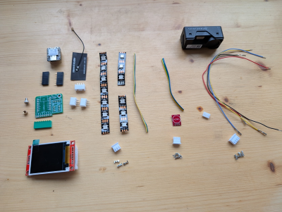

* XIAO Seeed ESP32-S3 or C3
* SEN66 sensor
* LCD 1.8 SPI
* WS2812b 13 Leds 60leds/m strip
* Custom PCB, order from JLCPCP or PCPWAY
* Touch button - TTP223
* 1 x 6pin GH1.25 male 
* 1 x 4pin JST-XH 2.5 male
* 2 x JST-XH 2.5 3pin male
* 1 x 4pin JST-XH 2.5 female
* 2 x 3pin JST-XH 2.5 female
* Heat insert: M3x5x4
* M3x5 Screw
* Some wires 
* Printed 3D Model, 3 parts

### Tools
* Soldering Iron
* Crimping tool

### Sensirion SEN66 - new, all-in-one aq sensor from Sensirion

It combines all the most important AQ sensors into one small package!

Unfortunately, the sensor is a bit expensive and harder to get, as it is brand new.

It starts around 55€ at the moment but I am sure the price will fall next year as it happened to the predecessor (SEN5X series).

I bought mine from Digikey, but here are some more links:

https://www.tme.eu/at/details/sen66-sin-t/gassensoren/sensirion/3-001-030/

https://www.mouser.at/ProductDetail/Sensirion/SEN66-SIN-T-ES

https://www.digikey.at/en/products/detail/sensirion-ag/sen66-sin-t/25700945

## PCB
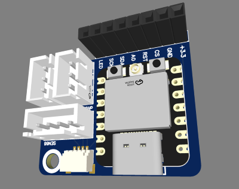

Gerber file to order at JLCPCP or PCBWAY or ....
[Gerber_aqMood_PCB_aqMood_seeed_c3_2025-03-14.zip](PCB/Gerber_aqMood_PCB_aqMood_seeed_c3_2025-03-14.zip)

or get it from here:

https://oshwlab.com/tobi.stanzel/aqmood

Qwiic connector is optional, as it would require SMD soldering equipment.

## Print instructions

3 files, the top can be printed in multi-color, i used 0.2 Speed settings on my XL and MK4 with PLA.

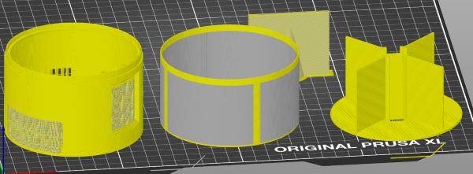

### AqMood-Bottom
This needs some supports, check example:

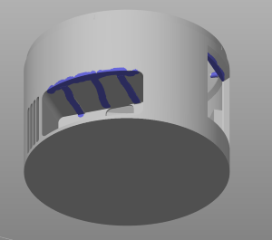

### AqMood-Top
When importing, choose "Yes" to "... single object having multiple parts?"

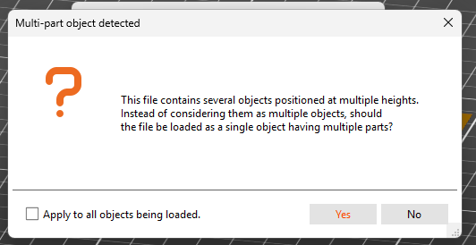

Print in transparent color or if you have a multicolor printer, set the parts like this (yellow is main color, gray is transparent)

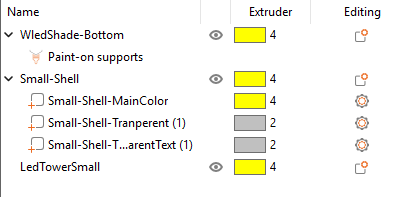

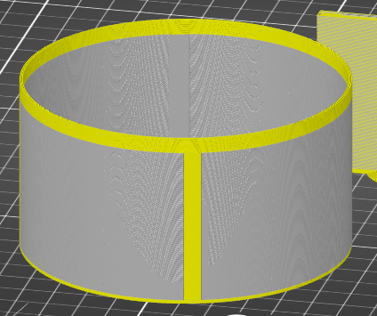

### AqMood-LedTower

Print in main color.

## Build

### Prepare PCB 

### Prepare Leds

### Prepare Touch Button

### Prepare SEN66

### Test Hardware 

### Final Assembly 

## Firmware

If you don't want to build and flash with esphome yourself, you can use one of the four pre-build firmwares:
* [firmware.c3.bin](esphome/bin/firmware.c3.bin)
* [firmware.c3.standalone.bin - no WIFI / Home Assistant](esphome/bin/firmware.c3.standalone.bin)
* [firmware.s3.bin](esphome/bin/firmware.s3.bin)
* [firmware.s3.standalone.bin - no WIFI / Home Assistant](esphome/bin/firmware.s3.standalone.bin)

https://web.esphome.io/ to flash one of the 2 provided firmeware flavours:

* With wifi and home assistant
* Standalone

Both are availiable for the S3 and the C3 variant, make sure you flaash the correct version!

Go to https://web.esphome.io/ connect your xiao-seed-esp32-s3 or c3 and hold reset and boot (both buttons), release reset first, this put the esp32 into flash mode.

Now hit connect and select the device
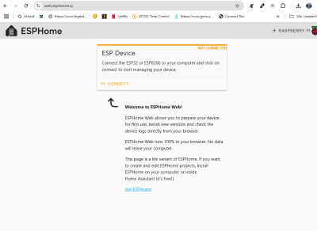

You will see a screen like this, hit "Install"
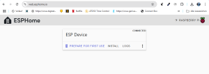

Select the firmware file and fit "upload", it will take 1-2 min to install
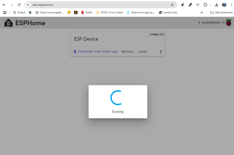

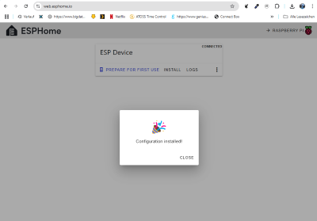

The firmware is now flashed and aqMood should reboot and start working!

## WIFI Setup

If you  choose to use aqMood together with home assistant, you need to connect aqMood to your wifi now

First, connect to the AP that is created

AP: mista-aq-mood-c3 or mista-aq-mood-s3
PW: aqMoodaqMood

Then go to '192.168.4.1' in your browser of choice
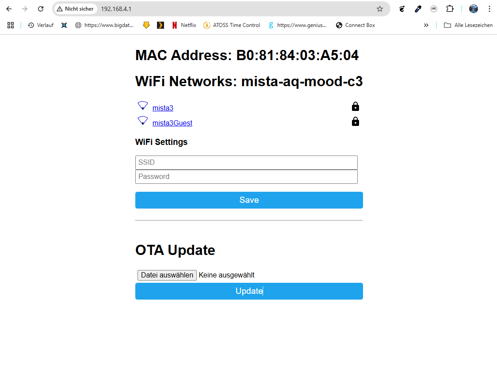

and set your SSID and PW, done!

## Home assistant 
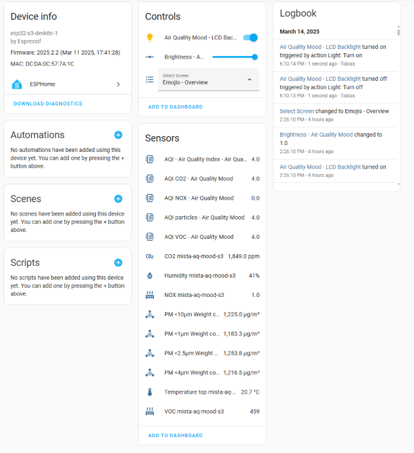

### Passwords for home assistant api and OTA

#### Home assistant api password
aqmoodpw

#### Esphome OTA password
aqmoodpw